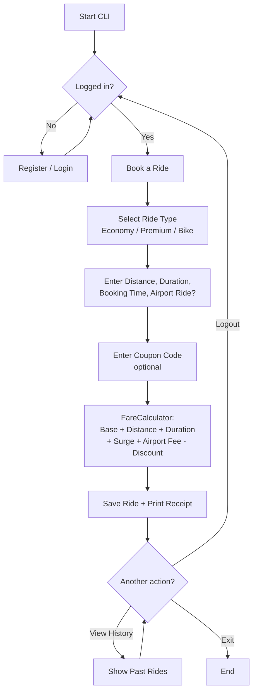
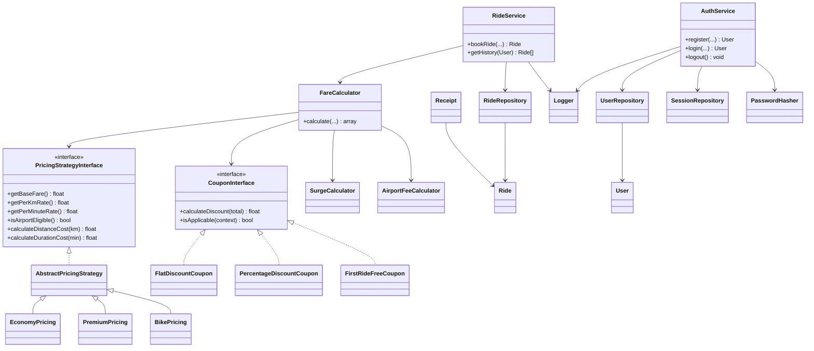
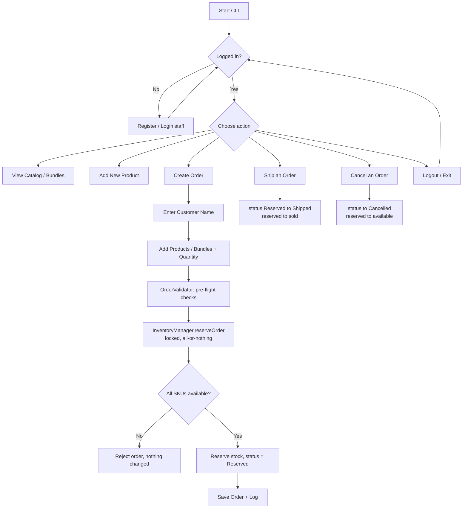

# Design Approach — Ride Fare System & Warehouse System

This document explains the architectural approach taken for both CLI PHP OOP
projects, the alternatives that were available, and the reasoning behind the
final choice — plus a flowchart and class diagram for each system.

---

# 1. Ride Fare Calculation System

## 1.1 What approach is used?

An Object-Oriented design built on two design patterns plus a thin service layer:

- **Strategy Pattern** for ride-type pricing (`PricingStrategyInterface` →
  `EconomyPricing` / `PremiumPricing` / `BikePricing`, sharing common math via
  an `AbstractPricingStrategy` base) and for coupons (`CouponInterface` →
  `FlatDiscountCoupon` / `PercentageDiscountCoupon` / `FirstRideFreeCoupon`)
- **Repository Pattern** for storage (`UserRepository`, `RideRepository`)
  backed by flat JSON files
- A **service layer** (`FareCalculator`, `AuthService`, `RideService`) that
  orchestrates the strategies + repositories, keeping `index.php` as a pure
  CLI/presentation layer

## 1.2 What other approaches could be used?

- **Pricing logic**: one `if/switch` block in a single calculator function;
  or pricing baked directly into ride-type subclasses (`EconomyRide extends
  Ride` with its own `calculateFare()`); or a config/lookup-table of rates
  with no dedicated classes at all
- **Coupons**: an `if/else` chain instead of separate coupon classes
- **Persistence**: a real relational database (MySQL/SQLite via PDO); an
  ORM; in-memory only (no persistence); or raw file I/O scattered through
  the code with no Repository abstraction
- **Object/storage coupling**: Active Record (each entity saves itself,
  e.g. `$ride->save()`) instead of separate Repository classes
- **Overall structure**: a full MVC framework (Laravel/Symfony-style)
  instead of plain, dependency-free OOP

## 1.3 Why this approach (and the case against the others)

**Strategy pattern** wins because ride types and coupon types are exactly
the "same interface, different math" variation it's built for — adding a
new ride type or coupon later means adding one new class, not editing
`FareCalculator`. The `if/switch` alternative works for 3 ride types but
doesn't scale, mixes every type's math into one function, and is harder to
test in isolation. Baking pricing into ride subclasses conflates "data
about a ride" with "how to price a ride" (single-responsibility violation)
and doesn't generalize to coupons the way a shared interface does. A
config/lookup-table loses type safety and can't express anything beyond
simple arithmetic.

**Repository + JSON** wins because the spec explicitly calls for JSON
storage for a dependency-free demo, but wrapping it behind Repository
methods means swapping to MySQL later (explicitly listed as a "Future
Improvement") only touches the repository classes, not `AuthService`/
`RideService`. A real database is the right production choice but needs a
server/credentials — overkill for a CLI demo. In-memory-only can't satisfy
the "ride history" requirement. Active Record is simpler for tiny apps but
tightly couples domain objects to the storage format and makes business
logic harder to unit-test in isolation from persistence. A full framework
would bury the OOP concepts the project exists to demonstrate under
routing/DI/ORM machinery that isn't the point of the exercise.

## 1.4 System Flow

## 1.5 Class Diagram

---

# 2. Warehouse Inventory & Order Management System

## 2.1 What approach is used?

A richer combination, matching the patterns the spec names explicitly:

- **Factory Pattern** (`ProductFactory`) to construct the correct `Product`
  subtype from a type string
- **Inheritance + polymorphism** for product types (`Product` →
  `PhysicalProduct` → `LimitedEditionProduct`, and `Product` →
  `DigitalProduct`), each overriding `reserve()` / `release()` / `ship()` /
  `validateOrderQuantity()`
- **Composition** for `Bundle` (has-many `BundleItem`) and `Order`
  (has-many `OrderItem`) — neither extends `Product`
- **Repository Pattern** with a shared `flock()`-based locking base class
  for concurrency-safe JSON I/O
- A **whitelist-based status guard** on `Order` (a transition map +
  `assertCanTransitionTo()`) rather than a full State-pattern hierarchy

## 2.2 What other approaches could be used?

- **Product typing**: one `Product` class with a `type` field and
  `if/switch` logic wherever behavior differs (no polymorphism); or
  composition instead of inheritance (`Product` has-a swappable
  `ProductBehavior`); or PHP traits mixed into a single class
- **Object creation**: scattered `new PhysicalProduct(...)` calls with no
  factory; named static constructors per subclass; or a fuller Abstract
  Factory/Builder for more complex construction
- **Concurrency control**: real database transactions with row-level
  locking; optimistic concurrency (version numbers + retry-on-conflict); a
  single-writer queue serializing all writes; OS-level semaphores; or no
  locking at all
- **Order status**: a full State Design Pattern (a separate class per
  status: `CreatedState`, `ReservedState`, etc.); a raw unchecked string
  field; or a PHP 8.1 native enum with transitions validated externally
- **Bundle modeling**: `Bundle extends Product` (inheritance); or a bundle
  as a raw array/JSON blob with no dedicated class
- **Persistence**: relational DB with foreign keys enforcing bundle→product
  referential integrity; a NoSQL store; in-memory only

## 2.3 Why this approach (and the case against the others)

**Inheritance for product types** fits because the differences are
genuinely "is-a" specializations — a `LimitedEditionProduct` *is* a
physical product with one tighter rule; a `DigitalProduct` *is* a product
with fundamentally different reservation semantics. This lets
`InventoryManager`/`ProductRepository` treat every product polymorphically
through the base `Product` type with zero type-checking branches, exactly
matching the spec's "demonstrate inheritance… and polymorphism" objective.
The flat-field-plus-switch alternative violates the open/closed principle
and spreads type logic across every method that touches a product. The
composition/has-a alternative is legitimate and more flexible for
runtime-swappable behavior, but it's extra indirection the spec's
straightforward hierarchy doesn't call for.

**Factory Pattern** earns its place because products are constructed in two
different places — the interactive "Add Product" screen and JSON
rehydration — and both need identical type→class resolution. Centralizing
it avoids two independent switch statements silently drifting apart as
types are added, and it's the pattern the spec names outright. Scattered
`new` calls duplicate that resolution logic; static named constructors
solve direct creation but still leave you needing a dispatcher for "I have
a string, give me a class" — so you haven't actually removed the need for a
factory, just left it unbuilt.

**`flock()` locking over database transactions** is the spec's own explicit
direction — "current implementation uses file locking… future database
implementation would use transactions." It needs no server, schema, or
credentials, and still genuinely demonstrates atomic reservation (validate
every SKU first, only then mutate, all under one exclusive lock — so a
failed bundle reservation leaves nothing changed). Real DB transactions are
the correct production answer but are explicitly out of scope here.
Optimistic concurrency adds retry-loop complexity without removing the need
for *some* locking primitive underneath. No locking at all directly fails
the "never oversell" requirement — two processes could both read "1
available" and both reserve it.

**A whitelist transition map over a full State Pattern** is the pragmatic
choice because no order status carries distinct *behavior* beyond "which
transitions are now illegal" — there's no different logging or calculation
per state. A full State Pattern (four separate classes) adds real overhead
for no behavioral payoff a lookup table doesn't already give. An unchecked
string field fails the spec's explicit "invalid transitions are rejected"
rule outright.

**Composition for `Bundle`** (rather than `Bundle extends Product`) is the
direct match for the spec's own instruction. A bundle has no real stock of
its own — its "availability" is entirely derived from its components — so
forcing it into the `Product` tree would mean faking `total_stock`/
`reserved_stock`/`sold_stock` fields that mean nothing, then special-casing
`reserve()` right back out to fan out to components anyway (composition
wearing an inheritance costume). A bundle as a raw array works for
read-only display but loses validation and a natural home for
`getItems()`/serialization logic.

## 2.4 System Flow

## 2.5 Class Diagram

```mermaid
classDiagram
    class PurchasableInterface {
        <<interface>>
        +getSku() string
        +getName() string
        +getProductType() string
    }

    class Product {
        <<abstract>>
        #sku string
        #name string
        #totalStock int
        #reservedStock int
        #soldStock int
        +getAvailableStock() int
        +validateOrderQuantity(qty) void
        +reserve(qty) void
        +release(qty) void
        +ship(qty) void
    }
    PurchasableInterface <|.. Product

    class PhysicalProduct
    class DigitalProduct
    class LimitedEditionProduct

    Product <|-- PhysicalProduct
    Product <|-- DigitalProduct
    PhysicalProduct <|-- LimitedEditionProduct

    class ProductFactory {
        +create(type,...) Product
        +fromArray(row) Product
    }
    ProductFactory ..> Product : creates

    class BundleItem {
        +sku string
        +quantity int
    }
    class Bundle {
        +getItems() BundleItem[]
    }
    PurchasableInterface <|.. Bundle
    Bundle *-- BundleItem

    class OrderItem {
        +itemType string
        +sku string
        +quantity int
    }
    class Order {
        +status string
        +assertCanTransitionTo(status) void
        +transitionTo(status) void
    }
    Order *-- OrderItem

    class Customer

    class OrderValidator {
        +validateItemSpec(...) void
    }
    class InventoryManager {
        +reserveOrder(Order) void
        +shipOrder(Order) void
        +cancelOrder(Order) void
    }
    class OrderService {
        +createOrder(...) Order
        +shipOrder(id) Order
        +cancelOrder(id) Order
    }

    OrderService --> OrderRepository
    OrderService --> InventoryManager
    OrderService --> OrderValidator
    InventoryManager --> ProductRepository
    InventoryManager --> BundleRepository
    OrderValidator --> ProductRepository
    OrderValidator --> BundleRepository

    class JsonFileRepository {
        <<abstract>>
        #readRows() array
        #transact(callable) void
    }
    class ProductRepository {
        +reserveMany(...) void
        +shipMany(...) void
        +releaseMany(...) void
    }
    class BundleRepository
    class OrderRepository {
        +createAndSave(...) Order
    }
    class UserRepository

    JsonFileRepository <|-- ProductRepository
    JsonFileRepository <|-- BundleRepository
    JsonFileRepository <|-- OrderRepository
    JsonFileRepository <|-- UserRepository

    class AuthService {
        +register(...) User
        +login(...) User
        +logout(User) void
    }
    class PasswordHasher
    class User
    AuthService --> UserRepository
    AuthService --> PasswordHasher

    class WarehouseException {
        <<abstract>>
    }
    class InsufficientStockException
    class InvalidOrderException
    class LimitedEditionException
    class BundleException

    WarehouseException <|-- InsufficientStockException
    WarehouseException <|-- InvalidOrderException
    WarehouseException <|-- LimitedEditionException
    WarehouseException <|-- BundleException
```

